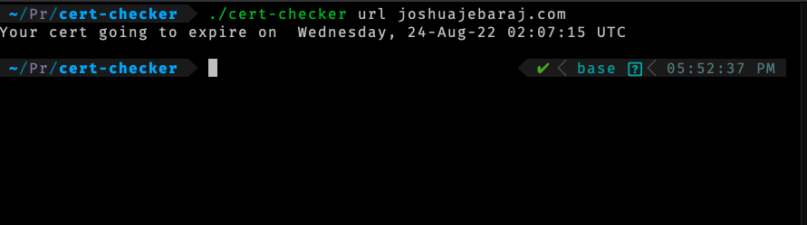

# Cert-Checker 

Simple Golang CLI tool that check the validity of the TLS certificate 


### Installation

- Download the binary from the release page [here](https://github.com/JOSHUAJEBARAJ/docker-secrets/releases/tag/v1.0)  and put it the path > Need to updated 
- To build locally 

* Clone the repository
```bash 
git clone https://github.com/JOSHUAJEBARAJ/cert-checker.git
```

Build the binary

```bash
go build .
```

## Usage

```
./cert-checker url joshuajebaraj.com
```


## Credits

Certificate validity code is took from https://www.freecodecamp.org/news/how-to-validate-ssl-certificates-in-go/ 